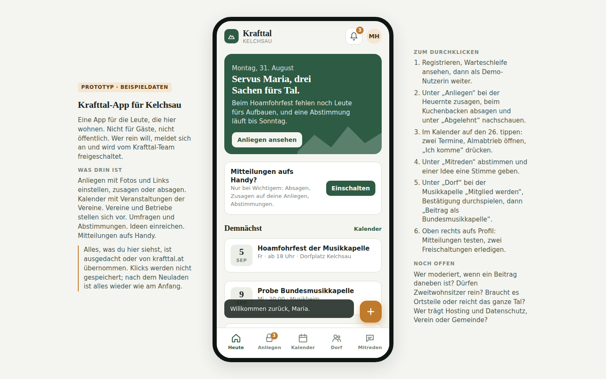

# Krafttal-App für die Kelchsau

Klickbarer Prototyp einer Community-App für die einheimische Bevölkerung der Kelchsau (Tirol), im Auftrag der Initiative Krafttal Kelchsau. Der Prototyp zeigt, wie die App aussehen und funktionieren soll. Er hat kein Backend, speichert nichts und enthält ausschließlich Beispieldaten.



## Ausprobieren

`index.html` im Browser öffnen, mehr braucht es nicht. Auf dem Desktop erscheint die App in einem Handyrahmen mit einer Erklärleiste daneben, auf dem Handy füllt sie den Bildschirm. Alternativ lokal servieren:

```
npm start
```

Der Prototyp ist außerdem als Claude-Artifact veröffentlicht (privat, Link beim Projektteam).

## Was der Prototyp zeigt

Anmeldung mit Freischaltung durch das Krafttal-Team. Anliegen (Hilfe gesucht, Biete, Hinweis, Verloren/Gefunden) mit Fotos, Links, Zusagen, Absagen und Kommentaren; abgesagte Beiträge liegen unter „Abgelehnt“. Monatskalender mit klickbaren Tagen und Terminliste. Vereine und Betriebe mit Vorstellungsseite, Kontaktdaten, Beitreten und Posten im Namen der Organisation. Abstimmungen, Ideen mit Status, Mitteilungen aufs Handy, Admin-Bereich für Freischaltungen, „Beitrag melden“.

Die Erklärleiste in der App enthält eine Klickreihenfolge zum Vorführen.

## Beispieldaten

Vereins- und Betriebsnamen stammen von krafttal.at. Feuerwehr, Landjugend, Kirchenchor, alle Personennamen, Telefonnummern, E-Mail-Adressen, Webadressen, Öffnungszeiten und Fotos sind erfunden oder Platzhalter. Vor einer Vorführung außerhalb des Teams entweder durch echte Daten ersetzen oder deutlich als Beispiel kennzeichnen.

## Dateien

`index.html` ist die komplette App in einer Datei (HTML, CSS, JavaScript, Daten). Die Beispieldaten stehen am Anfang des Script-Blocks in den Konstanten `anliegen`, `events`, `vereine`, `betriebe`, `polls`, `ideas` und `pending` und lassen sich dort direkt ändern.

`tests/klickpfade.js` klickt alle Abläufe im Headless-Browser durch und legt Screenshots in `tests/shots/` ab. Ausführen mit `npm install` und `npm test`.

## Stand und nächste Schritte

Version 0.3, 31. August 2026. Der Prototyp dient als Anforderungsliste für den Vergleich fertiger Plattformen (Crossiety, DorfFunk, Gem2Go) und für die Klärung der offenen Fragen mit dem Krafttal-Team. Der Konzeptstand (Entscheidungen, offene Fragen, Recherche) wird team-intern geführt und ist nicht Teil dieses Repos.
